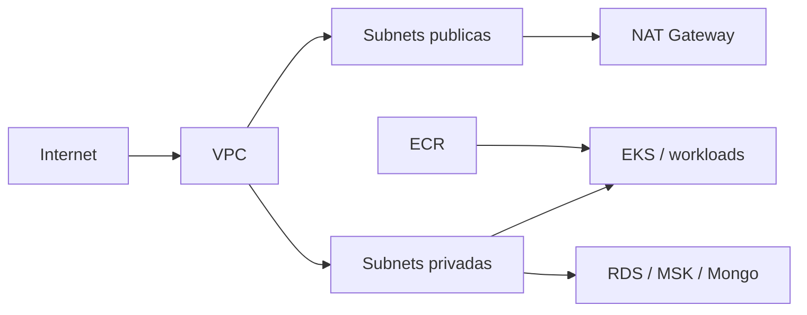

# OficinaConectada Foundation Infra

Repositorio dedicado ao provisionamento da camada base compartilhada da `OficinaConectada`.

## Escopo

- VPC com subnets publicas e privadas
- NAT Gateway e rotas privadas
- Security groups base
- ECR compartilhado para as 4 aplicacoes
- Outputs para integracao com `data-platform` e `platform-runtime`

## Stack

- Terraform
- AWS VPC
- AWS ECR
- GitHub Actions

## Autenticacao do pipeline

- `AWS_GITHUB_ACTIONS_ROLE_ARN` como GitHub Variable
- GitHub OIDC para assumir role na AWS

## O que este repositorio tambem provisiona

- provider OIDC do GitHub Actions na conta AWS
- role compartilhada para os pipelines dos repositorios:
  - `oficinaconectada-foundation`
  - `oficinaconectada-data-platform`
  - `oficinaconectada-platform-runtime`
  - `oficinaconectada-app-deployments`

## Segredos

Este repositorio nao depende de segredos aplicacionais no GitHub. A estrategia da fase 4 e centralizar segredos no AWS Secrets Manager e usar OIDC para eliminar credenciais estaticas no GitHub.

## Observacao de seguranca

Os valores sensiveis nao devem ser versionados em `terraform.tfvars` ou arquivos de estado locais.

## Execucao local

```bash
cd terraform
terraform init
terraform validate
terraform plan
```

## Deploy

- Pipeline principal: `.github/workflows/terraform.yml`
- Pipeline de destruicao: `.github/workflows/terraform-destroy.yml`

## Diagrama


